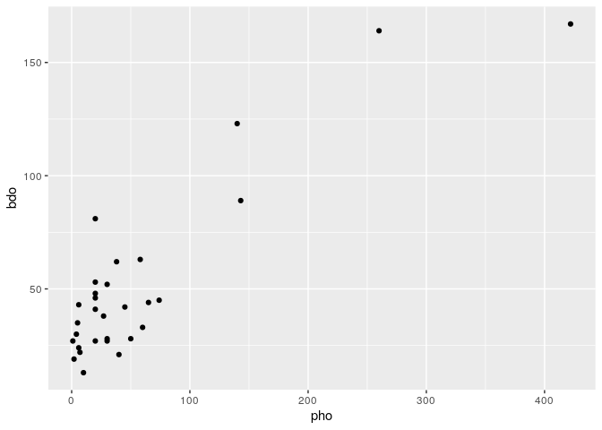
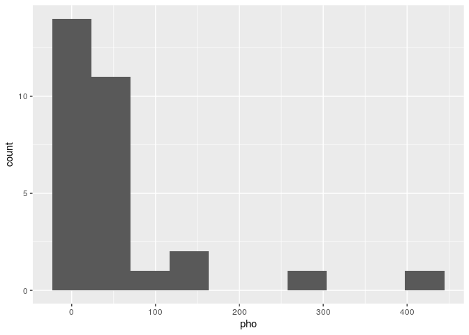
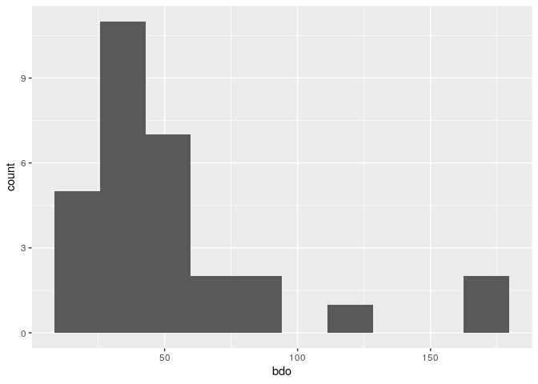
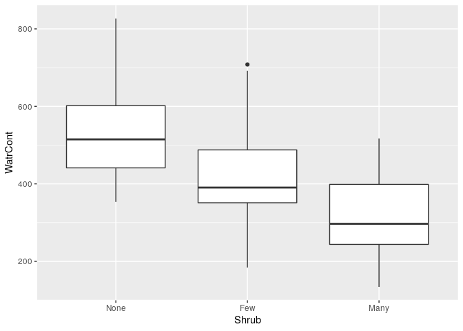

Continuación de: Introducción a R y análisis exploratorio de datos (AED o EDA)
==============================================================================

Estudia este texto, y responde a los siguientes mandatos. Donde veas `...` debes colocar lo que corresponda para cumplir el mandato. **Teje tu documento sólo cuando hayas completado todos los mandatos y no te queden `...`**. Ejecuta tu código en la consola de R, línea a línea. Recuerda configurar `Chunck Output in Console`.

Paquetes y conjuntos de datos
-----------------------------

Consulta las referencias sobre los paquetes necesarios y los conjuntos de datos [`doubs`](https://github.com/biogeografia-201902/material-de-apoyo/blob/master/ref/introduccion-a-r.md#el-conjunto-de-datos-doubs), [`BCI`](https://github.com/biogeografia-201902/material-de-apoyo/blob/master/ref/introduccion-a-r.md#el-conjunto-de-datos-bci) y [`mite`](https://github.com/biogeografia-201902/material-de-apoyo/blob/master/ref/introduccion-a-r.md#el-conjunto-de-datos-mite). Recuerda que `doubs` es un conjunto de datos incluido en una lista, mientras que `BCI` y `mite` tienen las matrices de comunidad y ambiental por separado.

``` r
library(vegan)
## Loading required package: permute
## Loading required package: lattice
## This is vegan 2.5-6
library(ade4)
data(mite)
data(doubs)
data(BCI)
data(mite.env)
data(BCI.env)
```

Basicos de una matriz de comunidad
----------------------------------

Consulta [esta referencia](https://github.com/biogeografia-201902/material-de-apoyo/blob/master/ref/introduccion-a-r.md#b%C3%A1sicos-de-una-matriz-de-comunidad) y cambia los `...` en los bloques de código a continuación por lo que corresponda.

-   Número de sitios de cada conjunto (doubs, BCI, mite)

``` r
nrow(mite)
## [1] 70
nrow(doubs$fish)
## [1] 30
nrow(BCI)
## [1] 50
```

-   Riqueza numérica de especies por sitio de `BCI`

``` r
specnumber(BCI)
##   1   2   3   4   5   6   7   8   9  10  11  12  13  14  15  16  17  18 
##  93  84  90  94 101  85  82  88  90  94  87  84  93  98  93  93  93  89 
##  19  20  21  22  23  24  25  26  27  28  29  30  31  32  33  34  35  36 
## 109 100  99  91  99  95 105  91  99  85  86  97  77  88  86  92  83  92 
##  37  38  39  40  41  42  43  44  45  46  47  48  49  50 
##  88  82  84  80 102  87  86  81  81  86 102  91  91  93
```

-   Riqueza numérica por sitios de `mite`. Adicionalmente, mostrar los sitios en orden ascendente y descendente según dicha variable

``` r
sort(specnumber(mite))
## 44 57 62 67 59 54 29 55 61 42 39 41 50 56 58 40 43 48 52 60 24 49 64 65 68 
##  5  5  6  6  7  8  9  9  9 10 11 11 11 11 11 12 12 12 12 12 13 13 13 13 13 
## 17 22 38 47 51 66 23 31 53 70  7  9 21 32 33 37 46 63 16 26 45 69 13 15 18 
## 14 14 14 14 14 14 15 15 15 15 16 16 16 16 16 16 16 16 17 17 17 17 18 18 18 
## 28 35 36  3  5 10 12 25  1 20  6  8 19 30 34 27  2  4 14 11 
## 18 18 18 19 19 19 19 19 20 20 21 21 21 21 21 22 23 23 23 25
sort(specnumber(mite), decreasing = T) #Usa la ayuda para determinar qué argumento debes colocar aquí
## 11  2  4 14 27  6  8 19 30 34  1 20  3  5 10 12 25 13 15 18 28 35 36 16 26 
## 25 23 23 23 22 21 21 21 21 21 20 20 19 19 19 19 19 18 18 18 18 18 18 17 17 
## 45 69  7  9 21 32 33 37 46 63 23 31 53 70 17 22 38 47 51 66 24 49 64 65 68 
## 17 17 16 16 16 16 16 16 16 16 15 15 15 15 14 14 14 14 14 14 13 13 13 13 13 
## 40 43 48 52 60 39 41 50 56 58 42 29 55 61 54 59 62 67 44 57 
## 12 12 12 12 12 11 11 11 11 11 10  9  9  9  8  7  6  6  5  5
```

-   Abundancia (número de individuos) de cada especie del conjunto `doubs`

``` r
colSums(doubs$fish)
## Cogo Satr Phph Neba Thth Teso Chna Chto Lele Lece Baba Spbi Gogo Eslu Pefl 
##   15   57   68   73   15   19   18   26   43   56   43   27   55   40   36 
## Rham Legi Scer Cyca Titi Abbr Icme Acce Ruru Blbj Alal Anan 
##   33   29   21   25   45   26   18   38   63   31   57   27
```

-   Abundancia por sitios (especies combinadas, *species pooled*) del conjunto `doubs`

``` r
rowSums(doubs$fish)
##  1  2  3  4  5  6  7  8  9 10 11 12 13 14 15 16 17 18 19 20 21 22 23 24 25 
##  3 12 16 21 34 21 16  0 14 14 11 18 19 28 33 40 44 42 46 56 62 72  4 15 11 
## 26 27 28 29 30 
## 43 63 70 87 89
```

-   Riqueza numérica en `doubs` (no por sitios)

``` r
specnumber(colSums(doubs$fish))
## [1] 27
```

-   Abundancia total en `doubs` (no por especie ni por sitios)

``` r
sum(colSums(doubs$fish))
## [1] 1004
```

-   De los conjuntos BCI y `mite`, ¿Cuál tiene más riqueza? Interpreta por qué entiendes que hay tanta diferencia de riqueza entre ambos conjuntos.

    -   Tu respuesta aquí: BCI, porque esta trabaja con arboles en un area mucho mayor (BCI trabaja en unos 500,000 m² y mite en 175 m²) y con una gran variedad de especies.

``` r
specnumber(colSums(mite))
## [1] 35
specnumber(colSums(BCI))
## [1] 225
```

Diagramas de dispersión y correlación
-------------------------------------

Consulta [esta referencia](https://github.com/biogeografia-201902/material-de-apoyo/blob/master/ref/introduccion-a-r.md#diagrama-de-dispersi%C3%B3n) y cambia los `...` en los bloques de código a continuación por lo que corresponda.

-   Inspección gráfica de la correlación (habría que verificar algunos supuestos, pero nos tomamos una licencia temporal). Realiza un diagrama de dispersión de las variables fosfatos y demanda biológica de oxígeno. ¿Existe relación entre ambas variables? ¿Directa o inversa? ¿Es lineal? Interpreta el resultado.

    -   Tu respuesta aquí: Tienen una relación directamente proporcional, una variable depende de la otra, cuando una aumenta la otra también en la misma proporción.

``` r
library(tidyverse)
## ── Attaching packages ─────────────────────────────────────────────────────────────────────────────────────── tidyverse 1.2.1 ──
## ✔ ggplot2 3.2.1     ✔ purrr   0.3.3
## ✔ tibble  2.1.3     ✔ dplyr   0.8.3
## ✔ tidyr   1.0.0     ✔ stringr 1.4.0
## ✔ readr   1.3.1     ✔ forcats 0.4.0
## ── Conflicts ────────────────────────────────────────────────────────────────────────────────────────── tidyverse_conflicts() ──
## ✖ dplyr::filter() masks stats::filter()
## ✖ dplyr::lag()    masks stats::lag()
ggplot(data = doubs$env) +
  geom_point(mapping = aes(x = pho, y = bdo))
```



-   El siguiente bloque de código muestra el valor de coeficiente de correlación lineal entre las variables anteriores. Interpreta el resultado.

    -   Tu respuesta aquí: Una correlación positiva. A mayor cantidad de fosfato, mayor es la demanda biológica de oxígeno.

``` r
cor(doubs$env$bdo, doubs$env$pho)
## [1] 0.8855369
cor.test(doubs$env$bdo, doubs$env$pho)
## 
##  Pearson's product-moment correlation
## 
## data:  doubs$env$bdo and doubs$env$pho
## t = 10.086, df = 28, p-value = 7.958e-11
## alternative hypothesis: true correlation is not equal to 0
## 95 percent confidence interval:
##  0.7713541 0.9444854
## sample estimates:
##       cor 
## 0.8855369
```

-   Realiza histogramas de ambas variables, uno por cada una. ¿Hacia dónde presentan sesgos ambas variables (derecha o izquierda)? ¿Por qué? ¿Es oportuno medir la correlación lineal entre estas variables?

    -   Tu respuesta aquí: Hacia la derecha. Porque la mayor parte de la muestra presenta valores bajos. Es oportuno medir la correlacion lineal, ya que ambas presentan sesgos hacia la misma dirección.

``` r
ggplot(data = doubs$env) +
  geom_histogram(mapping = aes(x = pho), bins = 10)
```



``` r
ggplot(data = doubs$env) +
  geom_histogram(mapping = aes(x = bdo), bins = 10)
```



-   Diagrama de cajas, *boxplot*. Realiza un diagrama de caja del contenido de agua del substrato (`WatrCont`) y la densidad de arbustos (`Shrub`). Interpreta el resultado.

    -   Tu respuesta aquí: Donde no hay densidad de arbustos la media del contenido de agua en el sustrato está más alta que en las demás muestras. Mientras tiene más densidad de arbustos la media del contenido de agua baja, por lo que se puede interpretar que a mayor densidad arbórea menor cantidad de agua en el sustrato.

``` r
ggplot(data = mite.env) +
  geom_boxplot(mapping = aes(x = Shrub, y = WatrCont))
```


